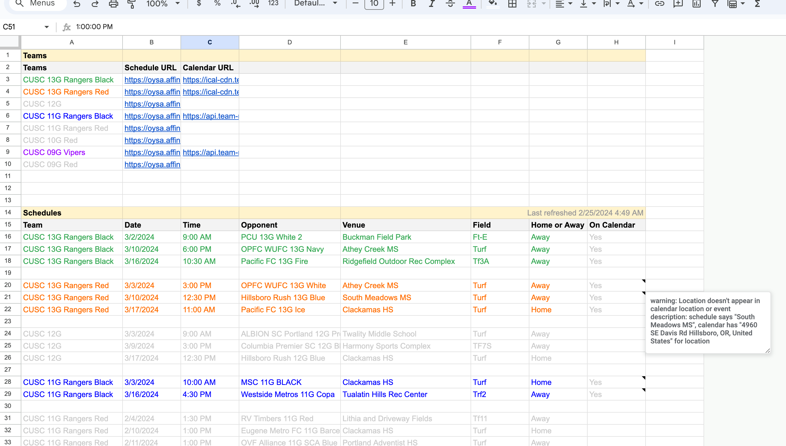

Google Apps Script project that is meant to run as an add-on menu item to a Google Sheet which will:
- Read a list of teams from the first dozen cells, each with their affinity soccer schedule URL and an optional iCal URL
- Scrapes each team's schedule from the web and injects it into the sheet in a structured format
- Combines all the schedules into a combined view for managing conflicts
- For those with iCal URL, will verify that the games on the schedule are synced properly to the iCal URL (which may be published by GameChanger or TeamSnap) and provide notes on items which are out of sync

This is used for [OYSA](https://oregonyouthsoccer.org/) schedules with teams in [Clackamas United Soccer Club](https://www.clackamasunited.com/), but provided as a public repo for code samples that may be of use to someone else.



# Prerequisites

Install [clasp](https://codelabs.developers.google.com/codelabs/clasp):
```
npm i @google/clasp -g
```

# Setup

Login to pull/push scripts:
```
make setup
```

# Push scripts
```
make push
```

# Pull scripts
```
make pull
```

# Open project on web
```
make open
```
